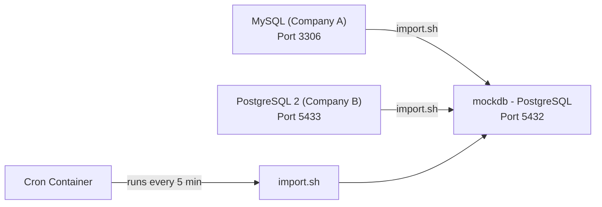

# Multi-Database Architecture with Cron Import

Build two additional source databases (one MySQL, one PostgreSQL) representing two different companies. A cron-based import script consolidates their data into the main `mockdb` PostgreSQL database.

## Architecture Overview



## Proposed Changes

### Docker Services

#### [MODIFY] [docker-compose.yml](file:///c:/Users/Arnau/Desktop/Agentes/Continnum/structured_ddbb/docker-compose.yml)

Add 4 services (total 5):

| Service | Image | Port | Database | Purpose |
|---------|-------|------|----------|---------|
| `postgres` | postgres:16 | 5432 | mockdb | Main consolidated DB (schema only, no initial data) |
| `mysql` | mysql:8 | 3306 | company_a_db | Source DB for Company A |
| `postgres2` | postgres:16 | 5433 | company_b_db | Source DB for Company B |
| `cron` | alpine + crond | — | — | Runs `import.sh` every 5 minutes |

---

### Seed Files

#### [MODIFY] [seed.sql](file:///c:/Users/Arnau/Desktop/Agentes/Continnum/structured_ddbb/seed.sql)

- Keep the full schema (users, products, orders, order_items, audit_log) with the `company` column
- **Remove all INSERT statements** — mockdb starts empty and gets populated only via imports

#### [NEW] [seed_mysql.sql](file:///c:/Users/Arnau/Desktop/Agentes/Continnum/structured_ddbb/seed_mysql.sql)

- Same table structure adapted for MySQL syntax (`AUTO_INCREMENT` instead of `SERIAL`, `DECIMAL` instead of `NUMERIC`, etc.)
- All rows have `company = 'SolarTech Industries'`
- 10 users, 10 products, 10 orders, ~12 order items, 10 audit log entries

#### [NEW] [seed_pg2.sql](file:///c:/Users/Arnau/Desktop/Agentes/Continnum/structured_ddbb/seed_pg2.sql)

- Same PostgreSQL schema as mockdb
- All rows have `company = 'NorthStar Logistics'`
- 10 users, 10 products, 10 orders, ~12 order items, 10 audit log entries

---

### Import Script

#### [NEW] [import.sh](file:///c:/Users/Arnau/Desktop/Agentes/Continnum/structured_ddbb/import.sh)

A Bash script that:

1. **Extracts** data from MySQL (`company_a_db`) using `mysqldump` or direct SQL queries via `mysql` client
2. **Extracts** data from PostgreSQL 2 (`company_b_db`) using `pg_dump` or `psql` queries
3. **Clears** the existing data in `mockdb` (truncate cascade)
4. **Inserts** the combined data into `mockdb`, preserving referential integrity (users → products → orders → order_items → audit_log)
5. Uses environment variables for credentials (set in docker-compose)

> [!IMPORTANT]
> The import does a **full replace** each run (truncate + re-insert). This keeps the logic simple and idempotent. If incremental/upsert logic is preferred, let me know.

---

### Cron Container

#### [NEW] [Dockerfile.cron](file:///c:/Users/Arnau/Desktop/Agentes/Continnum/structured_ddbb/Dockerfile.cron)

- Based on `alpine`
- Installs `postgresql-client` and `mysql-client`
- Copies `import.sh` and sets up a crontab entry (`*/5 * * * *`)

---

## Verification Plan

### Automated (run after `docker compose up -d`)

1. **Check all containers are healthy:**
   ```
   docker compose ps
   ```
   Expect 4 services running (postgres, mysql, postgres2, cron).

2. **Verify source databases have data:**
   ```
   docker exec pg_mock_db psql -U admin -d mockdb -c "SELECT count(*) FROM users;"
   docker exec mysql_company_a mysql -u admin -padmin1234 company_a_db -e "SELECT count(*) FROM users;"
   docker exec pg_company_b psql -U admin -d company_b_db -c "SELECT count(*) FROM users;"
   ```

3. **Trigger import manually and verify mockdb is populated:**
   ```
   docker exec cron_importer sh /import.sh
   docker exec pg_mock_db psql -U admin -d mockdb -c "SELECT company, count(*) FROM users GROUP BY company;"
   ```
   Expect two companies with 10 users each (20 total).

4. **Verify referential integrity in mockdb:**
   ```
   docker exec pg_mock_db psql -U admin -d mockdb -c "SELECT count(*) FROM orders;"
   docker exec pg_mock_db psql -U admin -d mockdb -c "SELECT count(*) FROM order_items;"
   ```
